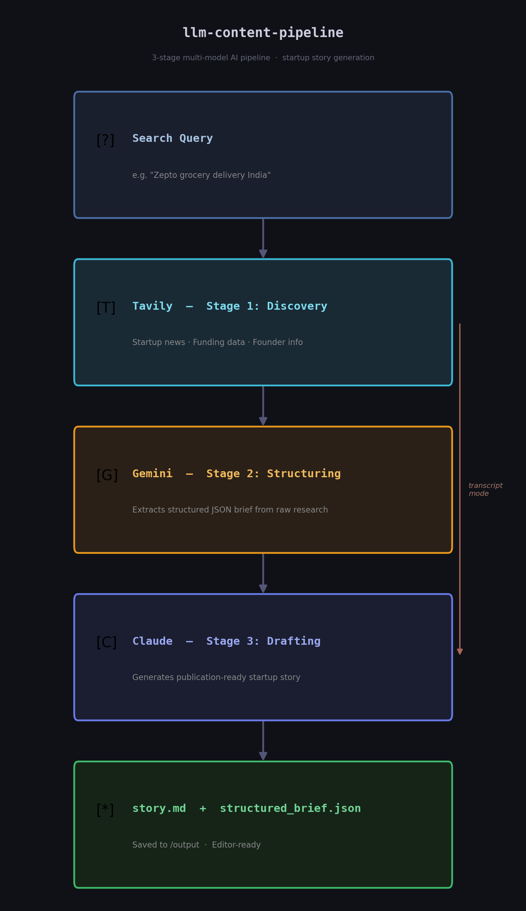

# startup-llm-content-pipeline

A 3-stage multi-model AI pipeline that automates startup story generation — from web discovery to publication-ready article.

## Problem

Startup stories and founder narratives are scattered across the web and interviews. 
Manually collecting, structuring, and converting them into publishable content is time-consuming and inconsistent.

This pipeline automates:
- discovery of startup information
- structuring into machine-readable format
- generation of coherent, publication-ready stories

## Design Decisions

- Multi-model approach avoids over-reliance on a single LLM
- Separation of stages improves modularity and debugging
- Structured JSON intermediate reduces hallucination in final output
  
## Pipeline Architecture



Alternatively, feed a raw founder interview transcript directly into Stage 3.

## Usage

**Full pipeline (query → story):**
```bash
python pipeline.py --query "Zepto grocery delivery India" --save
```

**Transcript only (transcript → story):**
```bash
python pipeline.py --transcript examples/sample_transcript.txt --save
```

## Setup

**1. Install dependencies:**
```bash
pip install -r requirements.txt
```

**2. Create a `.env` file:**
```
ANTHROPIC_API_KEY=your_key_here
GEMINI_API_KEY=your_key_here
TAVILY_API_KEY=your_key_here
```

**3. Get API keys:**
- Anthropic: platform.anthropic.com
- Gemini: aistudio.google.com
- Tavily: tavily.com (1000 free searches/month)

## Output

Running with `--save` creates an `/output` folder with:
- `story.md` — formatted startup article
- `structured_brief.json` — extracted startup data (query mode only)

## Repo Structure

```
llm-content-pipeline/
├── pipeline.py                        ← main script
├── requirements.txt
├── .gitignore
├── prompts/
│   ├── transcript_to_story.md         ← prompt for transcript mode
│   ├── data_extraction.md             ← prompt for JSON extraction
│   └── hallucination_control_rules.md ← prompt engineering reference
└── examples/
    ├── sample_transcript.txt          ← sample founder interview
    ├── sample_output_story.md         ← example story output
    └── sample_extraction_output.json  ← example JSON output
```

## Model Roles

| Stage | Model | Task |
|---|---|---|
| 1 — Discovery | Tavily | Web search for startup info |
| 2 — Structuring | Gemini 1.5 Flash | Extract structured JSON from research |
| 3 — Drafting | Claude Sonnet | Generate publication-ready story |

## Why multi-model?

Each model is used where it performs best:
- **Tavily** — purpose-built for AI search, returns clean cited results
- **Gemini** — reliable structured extraction, handles JSON formatting well
- **Claude** — strongest narrative generation with hallucination controls

## Results

### Example Input
Query: "Zepto grocery delivery India"

### Output
- Generated structured JSON with startup details
- Final article written in narrative format

### Observations
- Claude produced high-quality storytelling with good coherence
- Gemini provided consistent structured extraction
- Tavily ensured up-to-date factual grounding

### Sample Output
See: `examples/sample_output_story.md`

## Future Improvements

- Add caching layer to reduce API calls
- Implement retry mechanism for API failures
- Add evaluation metrics for output quality
- [ ] Model-agnostic support — let users configure their own API keys and choose models

## Author
**Biswajyoti Nath**
B.Tech Computer Science, Barak Valley Engineering College
[LinkedIn](https://linkedin.com/in/biswajyoti-nath-984404323) | [Portfolio](https://biswajyoti-nath.github.io)
